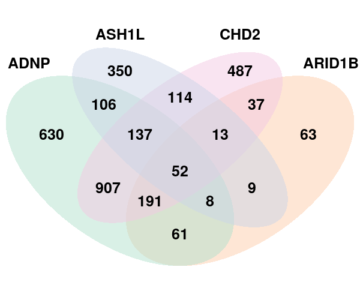
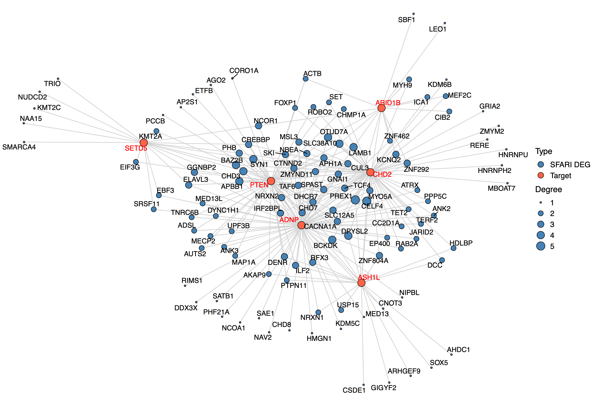

```{r setup, include=FALSE}
requireNamespace("pander", quietly = TRUE)
library(data.table)
library(Matrix)
library(tidyverse)
library(ggplot2)
theme_set(theme_bw() + theme(plot.title = element_text(size = 14, hjust = 0.5),
                             axis.title = element_text(size = 14),
                             axis.text = element_text(size = 12),
                             legend.title = element_text(size = 13),
                             legend.text = element_text(size = 12),
                             panel.grid.minor = element_blank())
)
library(gridExtra)
library(ComplexHeatmap)
library(kableExtra)

# set default chunk output
knitr::opts_chunk$set(echo = FALSE,
                      message = FALSE,
                      warning = FALSE,
                      comment = NA,
                      tidy = FALSE,
                      fig.width = 8,
                      fig.height = 6,
                      fig.align = "center",
                      results = "asis")

# formatting of pander tables
pander::panderOptions('knitr.auto.asis', FALSE)
pander::panderOptions("table.split.table", Inf)
```

```{r}
source("/project2/xinhe/yifan/Factor_analysis/reports/R/analytics_functions.R")
print_signif_tb <- function(signif_num, caption_text){
  if (length(signif_num) < 15){
    signif_num <- c(signif_num, rep(NA, 15 - length(signif_num)))
  }
  signif_num <- t(data.frame(KO = names(signif_num),
                             Num_genes = signif_num,
                             row.names = NULL))
  print(knitr::kable(rbind(signif_num[, 1:5], signif_num[, 6:10], signif_num[, 11:15]),
                     caption = caption_text) %>%
    kable_styling() %>% scroll_box(width = '100%'))
}
print_lfsr_signif_tb <- function(lfsr_mat, lfsr_cutoff, caption_text){
  signif_num <- colSums(lfsr_mat < lfsr_cutoff)
  print_signif_tb(signif_num, caption_text)
}

wkdir <- "/project2/xinhe/yifan/Factor_analysis/LUHMES/"
gsfa_folder <- "gsfa_output_detect_01/merged_new/"
guide <- "All"
pip_col_fun <- circlize::colorRamp2(breaks = c(0, 0.5, 1),
                                    colors = c("black", "purple", "gold"))
```

# GSFA on LUHMES CROP-seq Data

## Data Processing

Cells:    
LUHMES cells from 3 batches were merged together into 1 analysis. All cells have only a single type of gRNA readout. Quality control resulted in 8708 cells.

Genes:    
**Only genes detected in > 10% of cells were kept, resulted in 6213 genes.**

Normalization:    
Seurat "LogNormalize": log(count per 10K + 1).   
**Batch effect, unique UMI count, library size, and mitochondria percentage were all corrected for. The corrected and scaled expression data were used as input for subsequent factor analysis.**

## GSFA Results (SVD Initialization)

Here, our "guide", $G$ matrix, consists of 15 types (14 genes + NTC) of gene-level knock-down conditions across cells.

```{r load meta data}
metadata <- readRDS(paste0(wkdir, "processed_data/merged_metadata.rds"))
all_KOs.G_mat <- metadata[, 4:18]
KO_names <- colnames(all_KOs.G_mat)
if (guide == "no_NTC"){
  KO_names <- KO_names[KO_names != "Nontargeting"]
  all_KOs.G_mat <- all_KOs.G_mat[, KO_names]
}
nmarkers <- ncol(all_KOs.G_mat)
```

Gibbs sampling was initiated from SVD, and conducted for 2000 iterations; the posterior mean estimates were averaged over the last 500 iterations.

```{r svd_tb}
All_KOs.gibbs_PM <- readRDS(paste0(wkdir, gsfa_folder, guide, ".gibbs_obj_k20.svd.restart.PM.rds"))
stopifnot(nrow(All_KOs.gibbs_PM$beta_pm) == nmarkers + 1)
All_KOs.gibbs_res_tb <- make_gibbs_res_tb(All_KOs.gibbs_PM, all_KOs.G_mat, compute_pve = F)
```

### Estimate of Factor ~ Perturbation Associations ($\beta$)

```{r fig.width=9, fig.height=7}
reorder_KO <- c("ADNP", "ARID1B", "ASH1L", "CHD2", "PTEN", "SETD5",
                "CHD8", "CTNND2", "DYRK1A", "HDAC5", "MECP2", "MYT1L", "POGZ", "RELN",
                "Nontargeting")
dotplot_beta_PIP(t(All_KOs.gibbs_PM$Gamma_pm), t(All_KOs.gibbs_PM$beta_pm),
                 marker_names = colnames(all_KOs.G_mat), reorder_markers = reorder_KO)
```

```{r fig.width=4, fig.height=4, eval=FALSE, include=FALSE}
interest_factors <- paste0("Factor ", c(10, 11, 13, 15, 17, 18, 20))
interest_KOs <- c("ADNP", "ARID1B", "ASH1L", "CHD2", "PTEN", "SETD5")
# pdf("reports/figs/LUHMES_beta_of_interest_bubble_plot.pdf", width = 4, height = 4)
ggplot(beta_pm_plot_df %>% filter(Factor %in% interest_factors,
                                  Perturbation %in% interest_KOs) %>%
         mutate(Perturbation = factor(Perturbation, levels = interest_KOs[length(interest_KOs):1])),
       aes(x = Perturbation, y = Factor)) +
  geom_point(aes(size = PIP, color = `Estimated effect size`)) +
  scale_color_gradientn(colors = c("purple", "grey90", "darkorange1"),
                        values = scales::rescale(c(-0.6, 0, 0.6))) +
  theme_void() +
  theme(axis.text.x = element_text(size = 13, angle = 270, hjust = 0),
        axis.text.y = element_text(size = 13),
        legend.title = element_text(size = 13),
        legend.text = element_text(size = 12))
# dev.off()
```

Examples of factor ~ perturbation associations:
```{r fig.width=6, fig.height=6}
factor_loading_df <- data.frame(All_KOs.gibbs_PM$Z_pm)
names(factor_loading_df) <- paste0("Factor_", 1:ncol(factor_loading_df))
factor_loading_df <- cbind(factor_loading_df, all_KOs.G_mat)

paired_indx <- data.frame(factor = c(15, 13, 18, 20),
                          marker = c("ADNP", "ASH1L", "CHD2", "PTEN"),
                          stringsAsFactors = F)
plot_list <- list()
for (k in 1:nrow(paired_indx)){
  i <- paired_indx$factor[k]
  m <- paired_indx$marker[k]
  factor_loading_df[[m]] <- factor(factor_loading_df[[m]], levels = c(1, 0))
  plot_list[[k]] <- ggplot(factor_loading_df,
              aes_string(x = m, y = paste0("Factor_", i), color = m)) +
    geom_boxplot() +
    scale_color_manual(values = c("lightsalmon", "mediumseagreen")) +
    scale_x_discrete(labels = c(m, "Others")) +
    labs(y = paste0("Factor ", i, " Loading")) +
    theme(axis.text.x = element_text(size = 14),
          axis.title.x = element_blank(),
          legend.position = "none",
          panel.grid = element_blank())
}
do.call(grid.arrange,
        c(plot_list, list(top = textGrob("Example Associations", gp = gpar(fontsize = 14)))))
```

### DEGs (LFSR < 0.05) under Each Perturbation

```{r}
lfsr_cutoff <- 0.05
lfsr_mat <- readRDS(paste0(wkdir, gsfa_folder, guide, ".gibbs_obj_k20.svd.restart.lfsr_mat.rds"))
print_lfsr_signif_tb(lfsr_mat, lfsr_cutoff,
                     paste0("GSFA, # of genes that passed LFSR cutoff of 0.05:"))
```

Overlap of DEGs between perturbations:

```{r fig.width=5, fig.height=4}
num_signif_genes <- colSums(lfsr_mat < lfsr_cutoff)
signif_markers <- names(num_signif_genes)[which(num_signif_genes > 0)]
plot_pairwise.corr_heatmap(lfsr_mat[, signif_markers] < lfsr_cutoff, corr_type = "jaccard",
                           label_size = 11,
                           color_vec = c("#FFEDE6", "#FFA584", "#FF7F50"))
```

Venn diagram for DEGs found under perturbations ADNP, ARID1B, ASH1L, CHD2:

```{r venn, out.width = '60%'}

```

SFARI high risk (score 1, 2) genes among the DEGs:
```{r sfari_network, out.width = '100%'}

```

# Gene Set Enrichment Analysis

## Enrichment by factor

Target genes: Genes w/ non-zero loadings in each factor (PIP cutoff at 0.95);    
Backgroud genes: all 6213 genes included in factor analysis;    
Statistical test: hypergeometric test (over-representation test);    
Only GO terms/pathways within the size of 10 ~ 500 and have a test FDR $<$ 0.05 are shown in the webpages.

### Reactome Pathway Over-Representation Analysis

Gene sets: The [Reactome pathway database](http://www.reactome.org/).   

**Factors of interest**

* [Factor 8](http://www.webgestalt.org/results/1614728526/#): p53-Independent DNA Damage Response, G2/M Transition
* [Factor 9](http://www.webgestalt.org/results/1614728715/#): Neuronal System, Transmission across Chemical Synapses
* [Factor 12](http://www.webgestalt.org/results/1614728793/#): Gap junction trafficking
* [Factor 13](http://www.webgestalt.org/results/1614728429/#): Neurotransmitter receptors and postsynaptic signal transmission, Ion channel transport, Neuronal System
* [Factor 15](http://www.webgestalt.org/results/1614728922/#): Transmission across Chemical Synapses, Ca2+ pathway, Gap junction trafficking
* [Factor 17](http://www.webgestalt.org/results/1614729171/#): Axon guidance
* [Factor 19](http://www.webgestalt.org/results/1614729226/#): Activation of NMDA receptors and postsynaptic events, Mitotic phases, Cell Cycle Checkpoints
* [Factor 20](http://www.webgestalt.org/results/1614729303/#): Neurotransmitter receptors and postsynaptic signal transmission, Ion channel transport

### GO Slim Over-Representation Analysis

Gene sets: [Gene ontology](http://www.geneontology.org/) "Biological Process" (non-redundant).

**Factors of interest**

* [Factor 10](http://www.webgestalt.org/results/1614731260/#): nerve development, cell fate commitment;   
* [Factor 11](http://www.webgestalt.org/results/1614731201/#): chromatin remodeling, DNA recombination;   
* [**Factor 13**](http://www.webgestalt.org/results/1614731171/#): regulation of metal ion transport, axon development, ...;   
* [**Factor 15**](http://www.webgestalt.org/results/1614731117/#): neuron migration, response to metal ion, CNS neuron development, ...;   
* [**Factor 18**](http://www.webgestalt.org/results/1614730861/#): CNS neuron differentiation, xxx tissue development, ...;   
* [Factor 19](http://www.webgestalt.org/results/1614730760/#): axon development;   
* [**Factor 20**](http://www.webgestalt.org/results/1614730397/#): nerve development, neurotransmitter transport, ....

## Enrichment by perturbation

Target genes: Genes w/ LSFR < 0.05 under each perturbation;    
Backgroud genes: all 6213 genes included in factor analysis;    
Statistical test: hypergeometric test (over-representation test);    
Only GO terms/pathways within the size of 10 ~ 500 and have a test FDR $<$ 0.05 are shown in the webpages.

### Reactome Pathway Over-Representation Analysis

* [ADNP](http://www.webgestalt.org/results/1614735983/#)
    * [Up-regulated](http://www.webgestalt.org/results/1614748228/#)
    * Down-regulated
* [ARID1B](http://www.webgestalt.org/results/1614736635/#)
    * Up-regulated
    * [Down-regulated](http://www.webgestalt.org/results/1614748345/#)
* [ASH1L](http://www.webgestalt.org/results/1614736695/#)
    * [Up-regulated](http://www.webgestalt.org/results/1614748437/#)
    * [Down-regulated](http://www.webgestalt.org/results/1614748499/#): mRNA Splicing, Transcriptional Regulation by TP53
* [CHD2](http://www.webgestalt.org/results/1614737079/#)
    * [Up-regulated](http://www.webgestalt.org/results/1614748559/#)
    * [Down-regulated](http://www.webgestalt.org/results/1614748857/#): Axon guidance
* [PTEN](http://www.webgestalt.org/results/1614737261/#)
    * Up-regulated
    * [Down-regulated](http://www.webgestalt.org/results/1614749222/#): Axon guidance
* [SETD5](http://www.webgestalt.org/results/1614737506/#)
    * [Up-regulated](http://www.webgestalt.org/results/1614749447/#)
    * [Down-regulated](http://www.webgestalt.org/results/1614749474/#): Axon guidance

### GO Slim Over-Representation Analysis

* [ADNP](http://www.webgestalt.org/results/1614737785/#)
    * [Up-regulated](http://www.webgestalt.org/results/1614741328/#):regulation of metal ion transport, regulation of neurotransmitter levels
    * Down-regulated
* [ARID1B](http://www.webgestalt.org/results/1614737823/#)
    * Up-regulated
    * [Down-regulated](http://www.webgestalt.org/results/1614741644/#): regulation of metal ion transport
* [ASH1L](http://www.webgestalt.org/results/1614737877/#)
    * [Up-regulated](http://www.webgestalt.org/results/1614741821/#): regulation of metal ion transport
    * [Down-regulated](http://www.webgestalt.org/results/1614741971/#)
* [CHD2](http://www.webgestalt.org/results/1614737909/#)
    * [Up-regulated](http://www.webgestalt.org/results/1614742122/#)
    * [Down-regulated](http://www.webgestalt.org/results/1614742235/#): central nervous system neuron differentiation
* [PTEN](http://www.webgestalt.org/results/1614737973/#)
    * [Up-regulated](http://www.webgestalt.org/results/1614742400/#): regulation of ion transmembrane transport, regulation of neuron projection development
    * [Down-regulated](http://www.webgestalt.org/results/1614743125/#): regulation of metal ion transport
* [SETD5](http://www.webgestalt.org/results/1614738030/#)
    * [Up-regulated](http://www.webgestalt.org/results/1614743225/#): axon development, positive regulation of neurogenesis
    * [Down-regulated](http://www.webgestalt.org/results/1614743342/#)

## Enrichment by DEG degree

# Inspection of Signature Genes

## Genes targeted by CRISPR knock-down

```{r knockdown_targets}
source("/project2/xinhe/yifan/Factor_analysis/reports/R/gene_discovery_functions.R")
feature.names <- data.frame(fread(paste0(wkdir, "GSE142078_raw/GSM4219576_Run2_genes.tsv.gz"),
                                  header = FALSE), stringsAsFactors = FALSE)
names(feature.names) <- c("ID", "Name")
genes_indx <- match(rownames(lfsr_mat), feature.names$ID)
genes_df <- feature.names[genes_indx, ]

gsfa.DE_list <- compute_beta_dot_W(lfsr_mat, All_KOs.gibbs_PM)
gsfa.DE_list <- lapply(gsfa.DE_list, function(x){ left_join(x, feature.names,
                                                            by = c("gene_ID" = "ID")) })
for (m in signif_markers){
  if (!(m %in% gsfa.DE_list[[m]]$Name)){
    cat(paste0(m, " is not detected in > 10% cells."))
    cat("\n")
  } else {
    print(kable(gsfa.DE_list[[m]] %>% filter(Name == m) %>%
                  dplyr::select(Name, beta_W, lfsr, pass_lfsr),
                digits = 3,
                caption = paste0(m, " knock-down")) %>%
    kable_styling())
  }
}
```

## Neuron projection development genes ([GO:0010975](http://amigo.geneontology.org/amigo/term/GO:0010975))

According to Figure 4E of the [reference paper](https://genome.cshlp.org/content/30/9/1317.full), among these marker genes, mature neuron marker genes are down-regulated and negative regulator genes are up-regulated in ADNP, CHD2 and ASH1L knock-downs; while the opposite happens in PTEN knock-down.

Here we show all the marker genes that passed LFSR < 0.05 under each knock-down. In general, their effect sizes are consistent with the findings of the paper.

```{r neuron_projection_genes}
mature_neuron <- c('APBB1', 'DPYSL3', 'HSPA5', 'MAP1B', 'CRMP1', 'CRABP2', 'CCDC88A', 'UBE2V2',
                   'MAPT', 'NEFL', 'MEF2C', 'ZEB2')
negative_regulators <- c('ITM2C', 'CNTN2', 'ACAP3', 'GSK3B', 'SERPINF1')

npd_genes_df <- data.frame(Name = c(mature_neuron, negative_regulators),
                           Type = c(rep("neuron maturation", length(mature_neuron)),
                                    rep("negative regulator", length(negative_regulators))))
npd_genes_df <- npd_genes_df %>% filter(Name %in% genes_df$Name) %>%
  mutate(Type = factor(Type, levels = c("neuron maturation", "negative regulator")))
npd_indx <- match(npd_genes_df$Name, genes_df$Name)

for (m in signif_markers){
  print(kable(gsfa.DE_list[[m]][npd_indx, ] %>%
                mutate(Type = npd_genes_df$Type) %>%
                filter(pass_lfsr) %>%
                dplyr::select(Name, Type, beta_W, lfsr),
              digits = 3,
              caption = paste0(m, " knock-down")) %>%
          kable_styling())
}
```

```{r fig.width=7, fig.height=5}
# plot_markers <- c("ADNP", "ASH1L", "CHD2", "PTEN", "SETD5" )
npd_effect_size_mat <- matrix(nrow = nrow(npd_genes_df),
                              ncol = length(signif_markers))
rownames(npd_effect_size_mat) <- npd_genes_df$Name
colnames(npd_effect_size_mat) <- signif_markers
for (m in signif_markers){
  npd_effect_size_mat[, m] <- gsfa.DE_list[[m]][npd_indx, ] %>%
    mutate(effect_size = ifelse(pass_lfsr, beta_W, NA)) %>%
    pull(effect_size)
}

effectsize_colormap <- circlize::colorRamp2(breaks = c(-0.15, 0, 0.15),
                                            colors = c("blue", "gray90", "red"))
row_annot <- rowAnnotation(Type = npd_genes_df$Type,
                           col = list(Type = structure(c("chocolate4", "darkolivegreen"),
                                                       names = c("neuron maturation", "negative regulator"))),
                           show_annotation_name = F,
                           show_legend = F)
tmp <- npd_effect_size_mat
tmp[is.na(tmp)] <- 0
Heatmap(tmp,
        name = "Effect size (beta*W)",
        col = effectsize_colormap,
        na_col = "lightgrey",
        row_title = NULL, column_title = NULL,
        cluster_rows = T, cluster_columns = F,
        show_row_dend = F, show_column_dend = F,
        split = npd_genes_df$Type) + row_annot
```

```{r eval=FALSE, include=FALSE}
library(org.Hs.eg.db)
all_reg_genes <- select(org.Hs.eg.db, columns = c("SYMBOL"),
                    keytype = "GO", keys = "GO:0010975")$SYMBOL
all_reg_genes <- unique(all_reg_genes)

positive_reg_genes <- select(org.Hs.eg.db, columns = c("SYMBOL"),
                             keytype = "GO", keys = "GO:0010976")$SYMBOL
positive_reg_genes <- unique(positive_reg_genes)
negative_reg_genes <- select(org.Hs.eg.db, columns = c("SYMBOL"),
                             keytype = "GO", keys = "GO:0010977")$SYMBOL
negative_reg_genes <- unique(negative_reg_genes)
reg_genes_df <- data.frame(Name = c(positive_reg_genes, negative_reg_genes),
                           Type = c(rep("positive", length(positive_reg_genes)),
                                    rep("negative", length(negative_reg_genes))))
reg_genes_df <- reg_genes_df %>% filter(Name %in% genes_df$Name)
reg_genes_df$indx <- match(reg_genes_df$Name, genes_df$Name)
```

```{r eval=FALSE, include=FALSE}
m <- "CHD2"
kable(gsfa.DE_list[[m]][reg_genes_df$indx, ] %>%
              mutate(Type = reg_genes_df$Type) %>%
              filter(pass_lfsr) %>%
              dplyr::select(Name, Type, beta_W, lfsr),
              digits = 3,
              caption = paste0(m, " knock-down")) %>%
          kable_styling()
```

