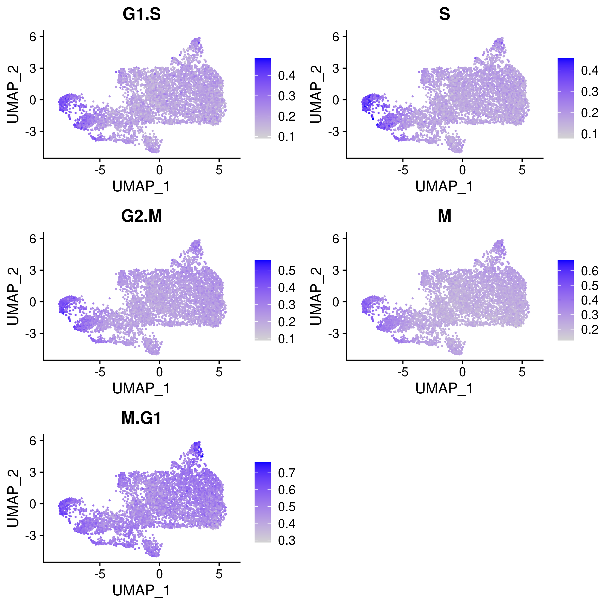

```{r setup, include=FALSE}
requireNamespace("pander", quietly = TRUE)
library(data.table)
library(Matrix)
library(tidyverse)
library(ggplot2)
theme_set(theme_bw() + theme(plot.title = element_text(size = 14, hjust = 0.5),
                             axis.title = element_text(size = 14),
                             axis.text = element_text(size = 12),
                             legend.title = element_text(size = 13),
                             legend.text = element_text(size = 12),
                             panel.grid.minor = element_blank())
)
library(gridExtra)
library(ComplexHeatmap)
library(kableExtra)

# set default chunk output
knitr::opts_chunk$set(echo = FALSE,
                      message = FALSE,
                      warning = FALSE,
                      comment = NA,
                      tidy = FALSE,
                      fig.width = 8,
                      fig.height = 6,
                      fig.align = "center",
                      results = "asis")

# formatting of pander tables
pander::panderOptions('knitr.auto.asis', FALSE)
pander::panderOptions("table.split.table", Inf)
wkdir <- "/project2/xinhe/yifan/Factor_analysis/GSE108699_MCF10A/"
```

```{r}
source("/project2/xinhe/yifan/Factor_analysis/reports/R/analytics_functions.R")
```

# Data Settings

CROP-seq data source:   
[On the design of CRISPR-based single cell molecular screens](https://www.ncbi.nlm.nih.gov/pmc/articles/PMC5882576/), GEO accession: GSE108699.

Cells:    
MCF10A cells (normal human breast epithelial cells) **with exposure to a DNA damaging agent, doxorubicin**;

Perturbations:    
CRISPR knock-outs of 29 tumor-suppressor genes (TP53, ...), 1 non-targeting control.

## Doxorubicin-treated expression data

There are 5584 cells with nonzero gRNA count.

```{r load gene expression, eval=FALSE, include=FALSE}
feature.names <- data.frame(fread(paste0(wkdir, 'data/GSE108699_cs.d.genes.tsv.gz'),
                                  header = FALSE), stringsAsFactors = FALSE)
barcode.names <- data.frame(fread(paste0(wkdir, 'data/GSE108699_cs.d.barcodes.tsv.gz'),
                                  header = FALSE), stringsAsFactors = FALSE)
dm <- readMM(file = paste0(wkdir, "data/GSE108699_cs.d.matrix.mtx"))
rownames(dm) <- feature.names$V1
colnames(dm) <- barcode.names$V1
dm.cells_w_gRNA <- dm[, dox_metadata$cell_barcode]
```

```{r gene_detection, eval=FALSE, fig.height=5, fig.width=6, include=FALSE}
gene_detection <- rowMeans(dm.cells_w_gRNA > 0)
qplot(gene_detection, bins = 50, xlab = "Gene Detection Rate")
```

## Perturbations

```{r load meta data, fig.width=9, fig.height=5}
metadata <- data.frame(fread(paste0(wkdir, 'data/GSE108699_cs.cell_metadata.tsv.gz'),
                             header = T, sep = '\t'), check.names = F)
dox_metadata <- metadata %>%
  filter(sample == "singles_dox_100nm_SI-3A-A6")
dox_metadata$cell_barcode <- sapply(strsplit(dox_metadata$cell, split = "_"),
                                    function(x){x[1]})
dox_metadata$guide_count[is.na(dox_metadata$guide_count)] <- 0
qplot(dox_metadata$guide_count,
      main = "Guide count per cell", xlab = "# of guides", ylab = "Count")
num_cells_per_guide <- colSums(dox_metadata[, 17:46])
num_cells.df <- data.frame(locus = names(num_cells_per_guide),
                           count = num_cells_per_guide)
ggplot(data = num_cells.df, aes(x=locus, y=count)) +
  geom_bar(stat="identity", width = 0.6) +
  labs(title = "Cell count per guide", x = "# of cells", y = "Count") +
  theme(axis.text.x = element_text(angle = 45, hjust = 1, size =11))
```

### Distribution of Knock-out Perturbations

```{r umap_KO, out.width = '100%'}
library(png)
library(grid)
img <- readPNG("figs/MCF10A_dox.umap_KO_patterns.png")
grid.raster(img)
# knitr::include_graphics("figs/umap_KO_patterns.png")
```

### Wilcoxon Differential Expression Test

Number of genes that passed pval_adjust < 0.2 under each perturbation:
```{r wilcox_DE}
DE_list <- readRDS(paste0(wkdir, "preprocess_output/DE_results.all_markers.seurat_wilcox.rds"))
DE_signif_counts <- sapply(DE_list, function(x){filter(x, p_val_adj < 0.2) %>% nrow()})
DE_signif_counts <- t(data.frame(KO = names(DE_signif_counts),
                                 DE_genes = DE_signif_counts,
                                 row.names = NULL))
knitr::kable(rbind(DE_signif_counts[, 1:10],
                   DE_signif_counts[, 11:20],
                   DE_signif_counts[, 21:30])) %>%
  kable_styling() %>% scroll_box(width = '100%')
```

```{r pval_FC_plot, fig.width=9, fig.height=7}
p1 <- ggplot(DE_list$TP53, aes(x = avg_logFC, y = -log10(p_val))) +
  geom_point(size = 1) +
  labs(x = "Average logFC", y = "-log10(P value)", title = "TP53")
p2 <- ggplot(DE_list$STK11, aes(x = avg_logFC, y = -log10(p_val))) +
  geom_point(size = 1) +
  labs(x = "Average logFC", y = "-log10(P value)", title = "STK11")
p3 <- ggplot(DE_list$BRCA1, aes(x = avg_logFC, y = -log10(p_val))) +
  geom_point(size = 1) +
  labs(x = "Average logFC", y = "-log10(P value)", title = "BRCA1")
p4 <- ggplot(DE_list$NONTARGETING, aes(x = avg_logFC, y = -log10(p_val))) +
  geom_point(size = 1) +
  labs(x = "Average logFC", y = "-log10(P value)", title = "Non Targeting Control")
grid.arrange(p1, p2, p3, p4, nrow = 2)
```

## Potential confounding factors

Positive correlation between number of guides and cell library size:
```{r libsize_confound, fig.height=5}
lm_coefficients <- summary(lm(dox_metadata$total_umis ~ dox_metadata$guide_count))$coefficients
ggplot(dox_metadata, aes(x = factor(guide_count), y = total_umis)) +
  geom_boxplot() +
  geom_abline(slope = lm_coefficients[2, 1], intercept = lm_coefficients[1, 1],
              color = "dodgerblue", linetype = "dashed") + 
  labs(x = "Guide count", y = "Total UMI count") +
  geom_text(x = max(dox_metadata$guide_count), y = max(dox_metadata$total_umis),
            label = paste0("p value = ", signif(lm_coefficients[2, 4], 2)),
            size = 5, color = "dodgerblue")
```

Cell cycle effects (colored by the mean expression of signature genes at the corresponding cell cycle stage):

```{r umap_cell_cycle, out.width = '100%'}
# img <- readPNG("figs/umap_cell_cycle_patterns.png")
# grid.raster(img)

```

## Preprocessing of RNA count matrix

Seurat "LogNormalize": log(count per $10^4$ + 1).

*Library size was regressed out, and the residuals were used as input.*

Only cells with gRNA readout and genes detected in > 10% of cells were kept.
