```{r setup, include=FALSE}
requireNamespace("pander", quietly = TRUE)
library(data.table)
library(Matrix)
library(tidyverse)
library(ggplot2)
theme_set(theme_bw() + theme(plot.title = element_text(size = 14, hjust = 0.5),
                             axis.title = element_text(size = 14),
                             axis.text = element_text(size = 12),
                             legend.title = element_text(size = 13),
                             legend.text = element_text(size = 12),
                             panel.grid.minor = element_blank())
)
library(gridExtra)
library(ComplexHeatmap)
library(kableExtra)

# set default chunk output
knitr::opts_chunk$set(echo = FALSE,
                      message = FALSE,
                      warning = FALSE,
                      comment = NA,
                      tidy = FALSE,
                      fig.width = 8,
                      fig.height = 6,
                      fig.align = "center",
                      results = "asis")

# formatting of pander tables
pander::panderOptions('knitr.auto.asis', FALSE)
pander::panderOptions("table.split.table", Inf)
```

```{r}
source("/project2/xinhe/yifan/Factor_analysis/reports/R/analytics_functions.R")
print_signif_tb <- function(signif_num, caption_text){
  signif_num <- t(data.frame(KO_target = names(signif_num),
                             Num_genes = signif_num,
                             row.names = NULL))
  print(knitr::kable(rbind(signif_num[, 1:7], signif_num[, 8:14], signif_num[, 15:21]),
                     caption = caption_text) %>%
    kable_styling() %>% scroll_box(width = '100%'))
}
wkdir <- "/project2/xinhe/yifan/Factor_analysis/Stimulated_T_Cells/"
gsfa_folder <- "gsfa_output_detect_01/stimulated_merged/"
guide <- "All"
```

# GSFA on Stimulated T Cell CROP-seq Data

## Data Processing

Cells:    
Primary human CD8+ T cells from two healthy donors, with T cell receptor (TCR) stimulation. Cells from 2 donors were pooled together into 1 analysis.   
All cells have only a single type of gRNA readout. Quality control resulted in 13983 cells.

Genes:    
**Only genes detected in > 10% of cells were kept, resulted in 6062 genes.**

Normalization:    
Seurat "LogNormalize": log(count per 10K + 1).   
**Batch effect, unique UMI count, library size, and mitochondria percentage were all corrected for. The corrected and scaled expression data were used as input for subsequent factor analysis.**

## GSFA Results (SVD Initialization)

Here, our "guide", $G$ matrix, consists of 15 types (14 genes + NTC) of gene-level knock-down conditions across cells.

```{r load meta data}
metadata <- readRDS(paste0(wkdir, "processed_data/metadata.stimulated_merged.rds"))
all_KOs.G_mat <- metadata[, 4:24]
KO_names <- colnames(all_KOs.G_mat)
nmarkers <- ncol(all_KOs.G_mat)
```

Gibbs sampling was initiated from SVD, and conducted for 2000 iterations; the posterior mean estimates were averaged over the last 500 iterations.

```{r svd_tb}
All_KOs.gibbs_PM <- readRDS(paste0(wkdir, gsfa_folder, guide, ".gibbs_obj_k20.svd.restart.PM.rds"))
stopifnot(nrow(All_KOs.gibbs_PM$beta_pm) == nmarkers + 1)
All_KOs.gibbs_res_tb <- make_gibbs_res_tb(All_KOs.gibbs_PM, all_KOs.G_mat, compute_pve = F)
```

### Estimate of Factor ~ Perturbation Associations ($\beta$)

```{r fig.width=9, fig.height=7}
beta_pm_plot_df <- dotplot_beta_PIP(t(All_KOs.gibbs_PM$Gamma_pm),
                                    t(All_KOs.gibbs_PM$beta_pm),
                                    marker_names = colnames(all_KOs.G_mat),
                                    return_dataframe = T)
```

Examples of factor ~ perturbation associations:
```{r fig.width=6, fig.height=6, eval=FALSE, include=FALSE}
factor_loading_df <- data.frame(All_KOs.gibbs_PM$Z_pm)
names(factor_loading_df) <- paste0("Factor_", 1:ncol(factor_loading_df))
factor_loading_df <- cbind(factor_loading_df, all_KOs.G_mat)

paired_indx <- data.frame(factor = c(15, 13, 18, 20),
                          marker = c("ADNP", "ASH1L", "CHD2", "PTEN"),
                          stringsAsFactors = F)
plot_list <- list()
for (k in 1:nrow(paired_indx)){
  i <- paired_indx$factor[k]
  m <- paired_indx$marker[k]
  factor_loading_df[[m]] <- factor(factor_loading_df[[m]], levels = c(1, 0))
  plot_list[[k]] <- ggplot(factor_loading_df,
              aes_string(x = m, y = paste0("Factor_", i), color = m)) +
    geom_boxplot() +
    scale_color_manual(values = c("lightsalmon", "mediumseagreen")) +
    scale_x_discrete(labels = c(m, "Others")) +
    labs(y = paste0("Factor ", i, " Loading")) +
    theme(axis.text.x = element_text(size = 14),
          axis.title.x = element_blank(),
          legend.position = "none",
          panel.grid = element_blank())
}
do.call(grid.arrange,
        c(plot_list, list(top = textGrob("Example Associations", gp = gpar(fontsize = 14)))))
```

### DEGs (LFSR < 0.05) under Each Perturbation

Number of genes that passed GSFA LFSR < 0.05 under each perturbation:

```{r lfsr}
lfsr_cutoff <- 0.05
lfsr_mat <- readRDS(paste0(wkdir, gsfa_folder, guide, ".gibbs_obj_k20.svd.restart.lfsr_mat.rds"))
lfsr_signif_num <- colSums(lfsr_mat < lfsr_cutoff)
print_signif_tb(lfsr_signif_num, paste0("GSFA, LFSR cutoff at ", lfsr_cutoff))
```

```{r ttest_DE}
fdr_cutoff <- 0.05
DE_list <- readRDS(paste0(wkdir, "processed_data/DE_results.custom_ttest.stimulated_merged.detect_01.corrected.rds"))
DE_signif_counts <- sapply(DE_list, function(x){filter(x, fdr < fdr_cutoff) %>% nrow()})
# print_signif_tb(DE_signif_counts, paste0("Welch's t-test, FDR cutoff at ", fdr_cutoff))
```

```{r deseq}
library(DESeq2)
deseq_list <- list()
for (m in KO_names){
  fname <- paste0(wkdir, "processed_data/DESeq2/stimulated_merged.gRNA_", m,
                  ".filtered_by_detection_0.1.rds")
  res <- readRDS(fname)
  res <- as.data.frame(res@listData, row.names = res@rownames)
  deseq_list[[m]] <- res
}
deseq_signif_counts <- sapply(deseq_list, function(x){filter(x, padj < fdr_cutoff) %>% nrow()})
```

```{r edger}
# library(edgeR)
edger_list <- list()
for (m in KO_names){
  fname <- paste0(wkdir, "processed_data/edgeR_qlf/stimulated_merged.gRNA_", m,
                  ".filtered_by_detection_0.1.rds")
  edger_list[[m]] <- readRDS(fname)
}
edger_signif_counts <- sapply(edger_list, function(x){filter(x, FDR < fdr_cutoff) %>% nrow()})
```

```{r dge_comparison_log, fig.width=10, fig.height=7}
dge_comparison_df <- data.frame(Perturbation = names(lfsr_signif_num),
                                GSFA = lfsr_signif_num,
                                edgeR = edger_signif_counts,
                                DESeq = deseq_signif_counts,
                                t.test = DE_signif_counts)
dge_comparison_df <- reshape2::melt(dge_comparison_df, id.var = "Perturbation",
                                    variable.name = "Method", value.name = "Num_DEGs")
ggplot(dge_comparison_df, aes(x = Perturbation, y = Num_DEGs+1, fill = Method)) +
  geom_bar(position = "dodge", stat = "identity") +
  scale_y_log10() +
  scale_fill_brewer(palette = "Set2") +
  labs(x = "Knock-Out Target",
       y = "Number of DEGs + 1",
       title = "Number of DEGs using different methods (LFSR or FDR cutoff at 0.05)") +
  theme(axis.text.x = element_text(angle = 45, hjust = 1, size = 12))
```

```{r dge_comparison, fig.width=10, fig.height=7}
ggplot(dge_comparison_df, aes(x = Perturbation, y = Num_DEGs, fill = Method)) +
  geom_bar(position = "dodge", stat = "identity") +
  scale_fill_brewer(palette = "Set2") +
  labs(x = "Knock-Out Target",
       y = "Number of DEGs",
       title = "Number of DEGs using different methods (LFSR or FDR cutoff at 0.05)") +
  theme(axis.text.x = element_text(angle = 45, hjust = 1, size = 12))
```

Overlap of GSFA DEGs between perturbations:

```{r fig.width=6, fig.height=5}
num_signif_genes <- colSums(lfsr_mat < lfsr_cutoff)
signif_markers <- names(num_signif_genes)[which(num_signif_genes > 0)]
plot_pairwise.corr_heatmap(lfsr_mat[, signif_markers] < lfsr_cutoff, corr_type = "jaccard",
                           label_size = 11,
                           color_vec = c("#FFEDE6", "#FFA584", "#FF7F50"))
```

# Gene Set Enrichment Analysis

## Enrichment by factor

Target genes: Genes w/ non-zero loadings in each factor (PIP cutoff at 0.95);    
Backgroud genes: all 6062 genes included in factor analysis;    
Statistical test: hypergeometric test (over-representation test);    
Gene sets: GO Slim "Biological Process" (non-redundant);    
Only GO gene sets within the size of 10 ~ 500 and have an enrichment FC > 2 and FDR < 0.05 are kept.

We used the "Wang" method in `GOSemSim` to measure the similarity between GO BP terms, and all the significant terms in factors of interest were further grouped into 12 clusters using hierarchical clustering with the "ward.D" agglomeration method. The clustering results of all these GO BP terms are stored [here](https://drive.google.com/drive/folders/1VTXE-bknsCr5mV022HbQqU6NP29qfp_U).

### Terms of Interest

```{r fig.width=6, fig.height=5}
interest_factors <- paste0("Factor ", c(7, 8, 9, 11, 13, 14, 17, 18, 19, 20))
interest_KOs <- c("ARID1A", "CBLB", "CD3D", "CD5", "CDKN1B", "DGKA", "LCP2", "RASA2", "TCEB2")

ggplot(beta_pm_plot_df %>%
         filter(Factor %in% interest_factors,
                Perturbation %in% interest_KOs) %>%
         mutate(Perturbation = factor(Perturbation, levels = interest_KOs[length(interest_KOs):1]),
                Factor = factor(Factor, levels = paste0("Factor ", 1:nrow(beta_pm_plot_df)))),
       aes(x = Factor, y = Perturbation)) +
  geom_point(aes(size = PIP, color = `Estimated effect size`)) +
  scale_color_gradient2(low = "purple3", mid = "grey90", high = "darkorange1") +
  theme_void() +
  theme(axis.text.x = element_text(size = 13, angle = 90, hjust = 0),
        axis.text.y = element_text(size = 13),
        legend.title = element_text(size = 13),
        legend.text = element_text(size = 12))
```

```{r out.width = "80%"}
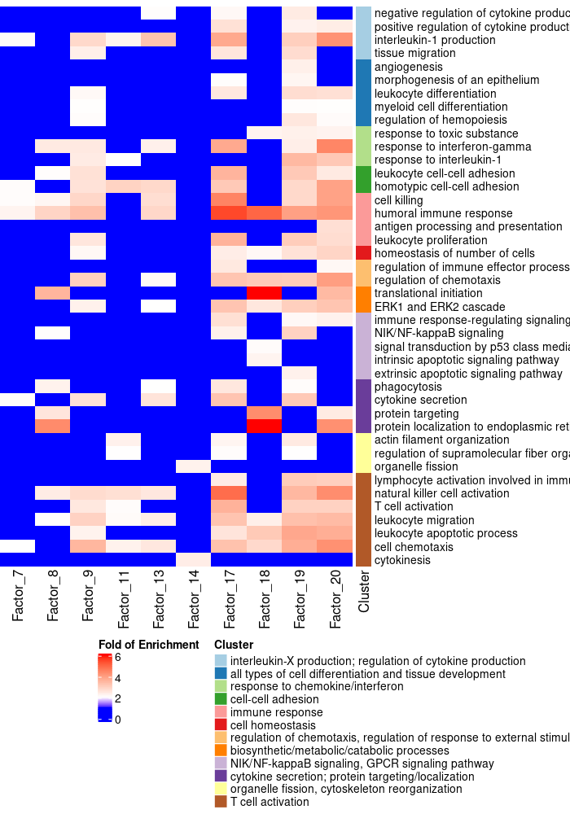
```

### Terms in All Factors of Interest

```{r out.width = "100%"}
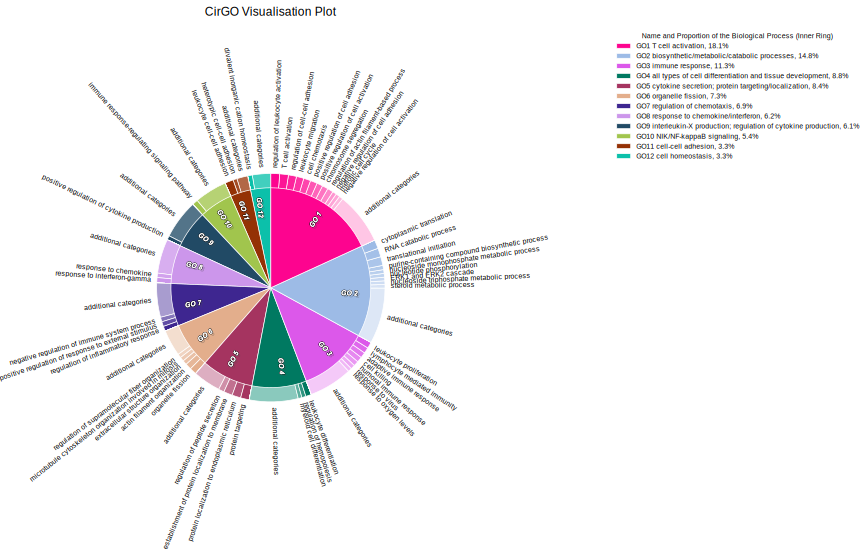
```

### Terms in Factor 7

```{r out.width = "100%"}
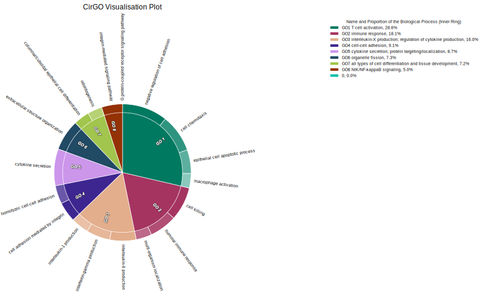
```

### Terms in Factor 8

```{r out.width = "100%"}
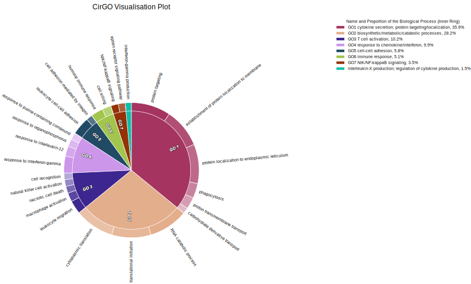
```

### Terms in Factor 9

```{r out.width = "100%"}
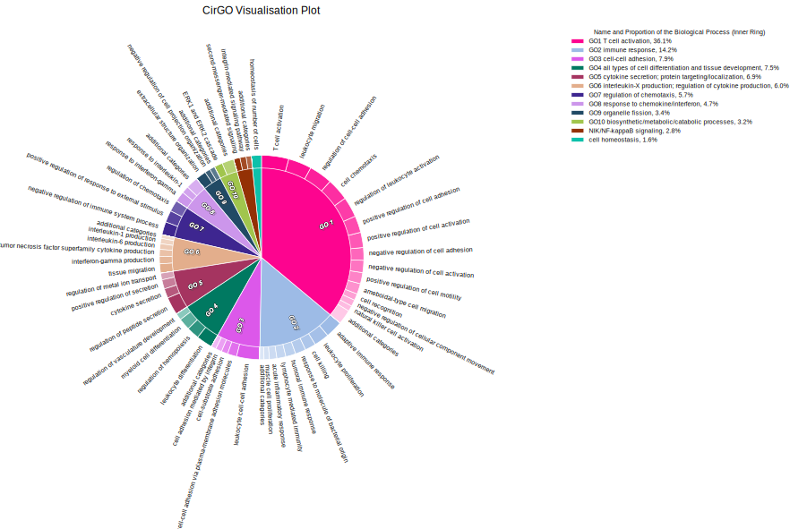
```

### Terms in Factor 11

```{r out.width = "100%"}
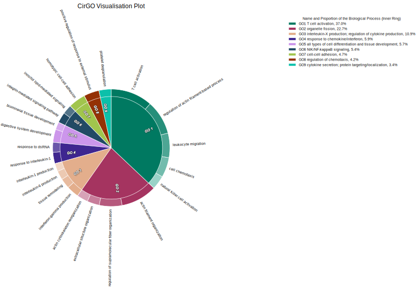
```

### Terms in Factor 13

```{r out.width = "100%"}
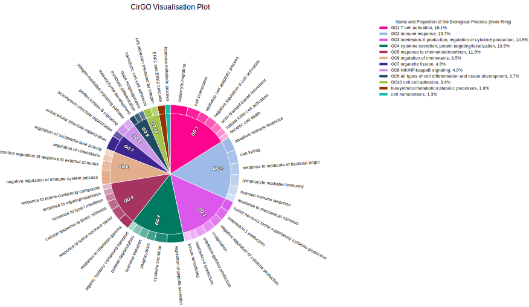
```

### Terms in Factor 14

```{r out.width = "100%"}
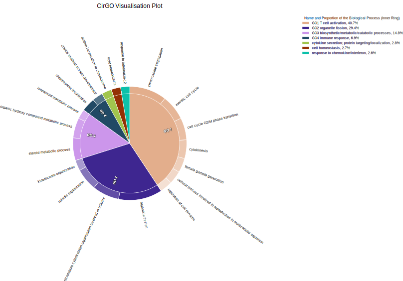
```

### Terms in Factor 17

```{r out.width = "100%"}
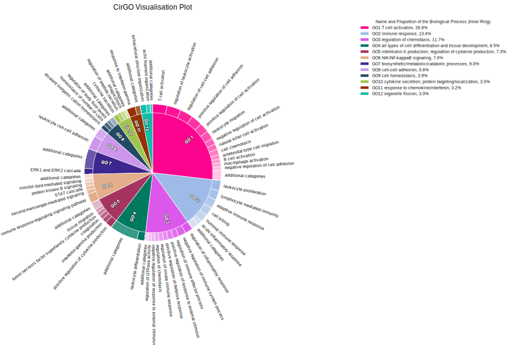
```

### Terms in Factor 18

```{r out.width = "100%"}
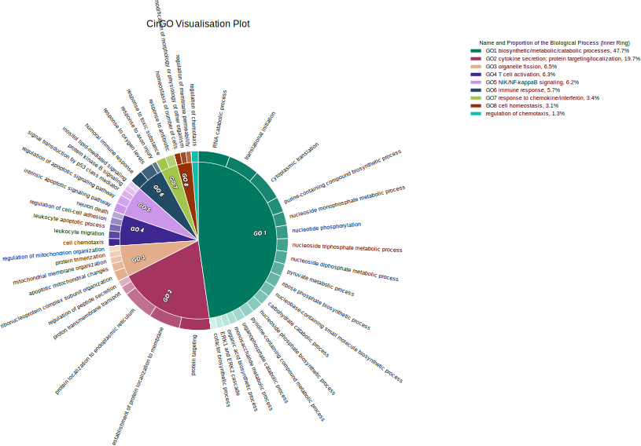
```

### Terms in Factor 19

```{r out.width = "100%"}
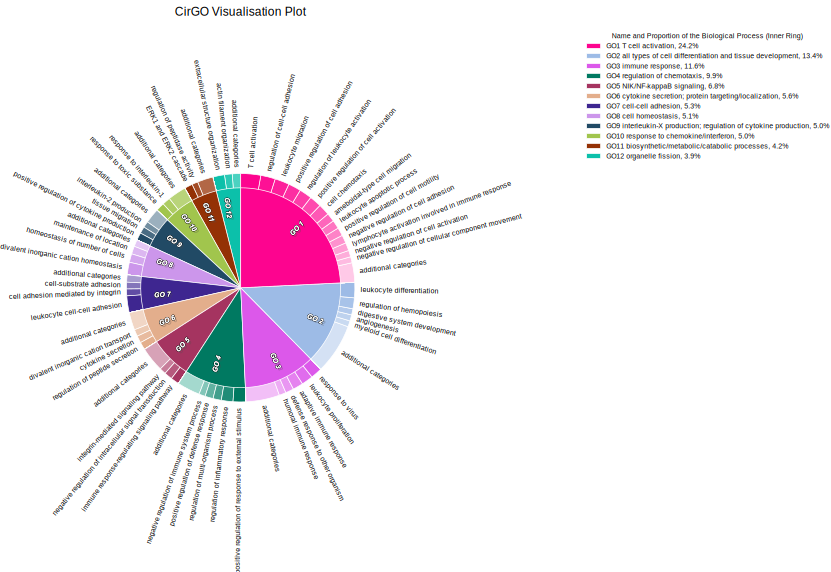
```

### Terms in Factor 20

```{r out.width = "100%"}
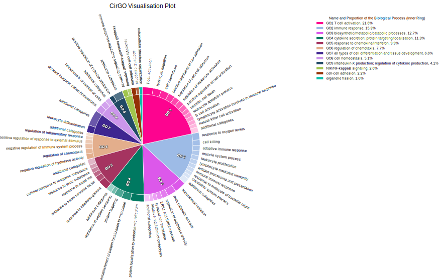
```

# Inspection of Signature Genes

## Genes targeted by CRISPR knock-down

```{r knockdown_targets}
source("/project2/xinhe/yifan/Factor_analysis/reports/R/gene_discovery_functions.R")
feature.names <- data.frame(fread(paste0(wkdir, "GSE119450_RAW/D1S/genes.tsv"),
                                  header = FALSE), stringsAsFactors = FALSE)
names(feature.names) <- c("ID", "Name")
genes_indx <- match(rownames(lfsr_mat), feature.names$ID)
genes_df <- feature.names[genes_indx, ]

gsfa.DE_list <- compute_beta_dot_W(lfsr_mat, All_KOs.gibbs_PM)
gsfa.DE_list <- lapply(gsfa.DE_list, function(x){ left_join(x, feature.names,
                                                            by = c("gene_ID" = "ID")) })
for (m in signif_markers){
  if (!(m %in% gsfa.DE_list[[m]]$Name)){
    cat(paste0(m, " is not detected in > 10% cells."))
    cat("\n")
  } else {
    print(kable(gsfa.DE_list[[m]] %>% filter(Name == m) %>%
                  dplyr::select(Name, beta_W, lfsr, pass_lfsr),
                digits = 3,
                caption = paste0(m, " knock-down")) %>%
    kable_styling())
  }
}
```

