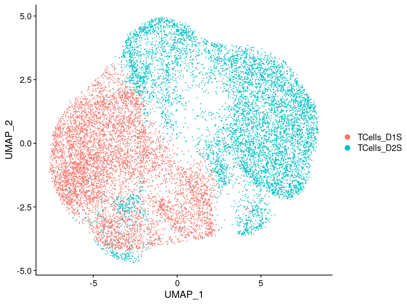
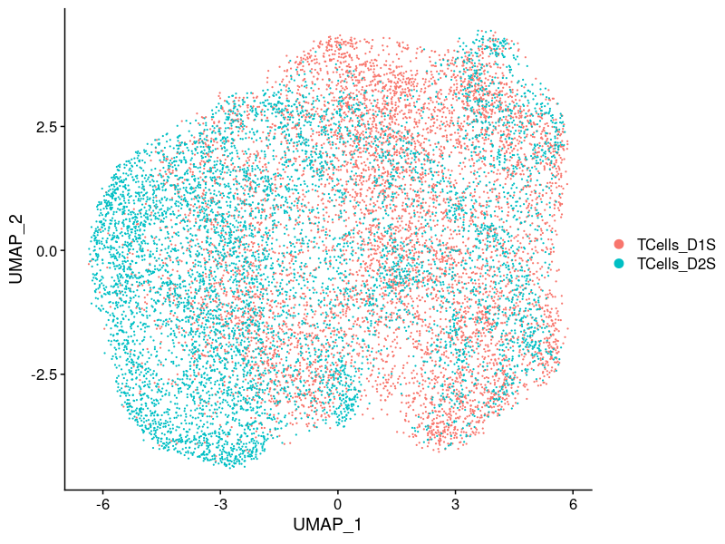
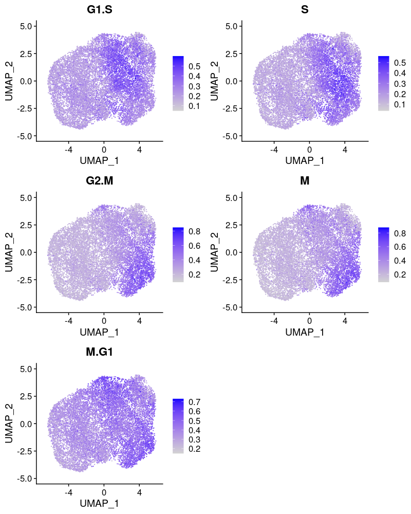
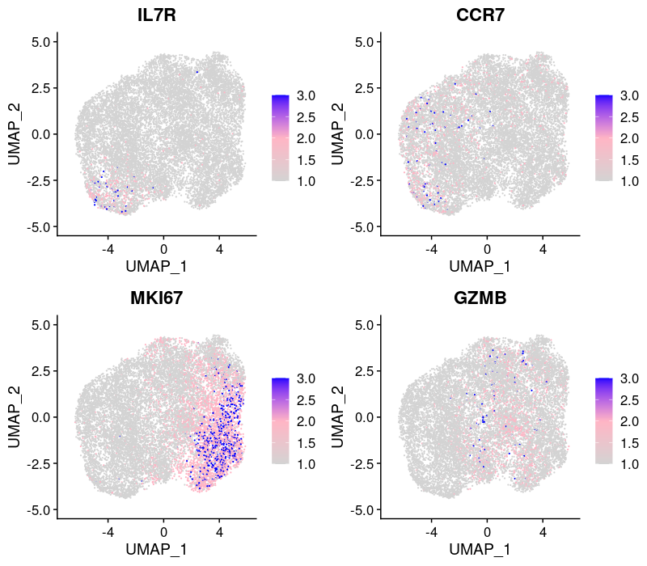
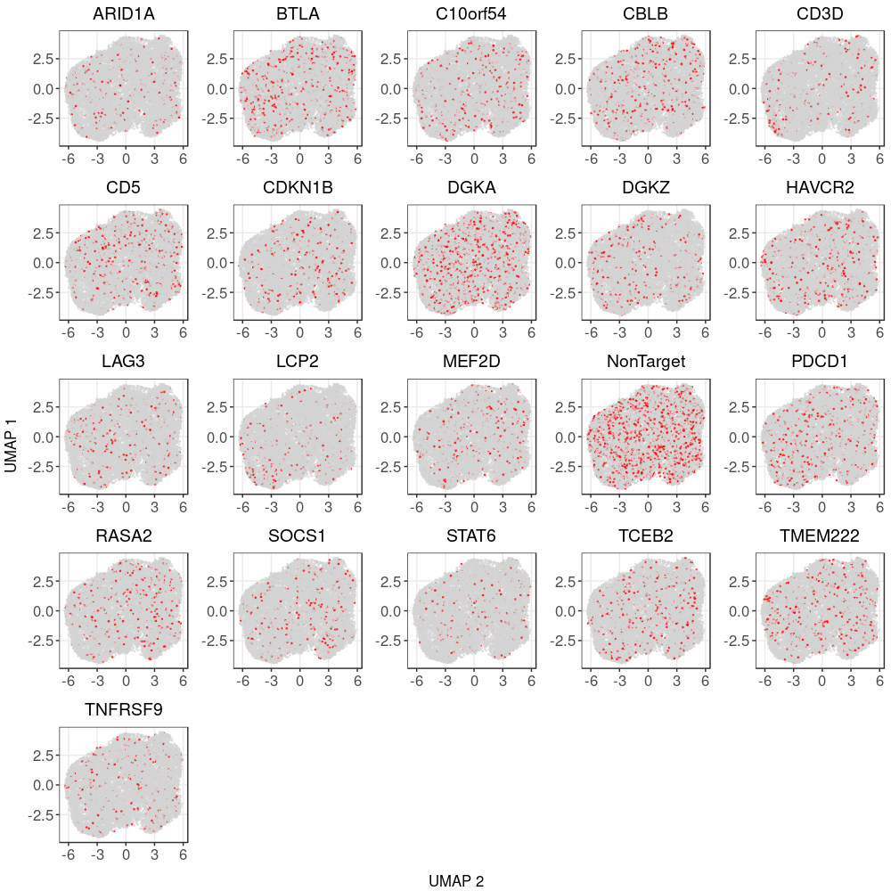

```{r setup, include=FALSE}
requireNamespace("pander", quietly = TRUE)
library(data.table)
library(Matrix)
library(tidyverse)
library(ggplot2)
theme_set(theme_bw() + theme(plot.title = element_text(size = 14, hjust = 0.5),
                             axis.title = element_text(size = 14),
                             axis.text = element_text(size = 12),
                             legend.title = element_text(size = 13),
                             legend.text = element_text(size = 12),
                             panel.grid.minor = element_blank())
)
library(gridExtra)
library(ComplexHeatmap)
library(kableExtra)
library(Seurat)
# set default chunk output
knitr::opts_chunk$set(echo = FALSE,
                      message = FALSE,
                      warning = FALSE,
                      comment = NA,
                      tidy = FALSE,
                      fig.width = 8,
                      fig.height = 6,
                      fig.align = "center",
                      results = "asis")

# formatting of pander tables
pander::panderOptions('knitr.auto.asis', FALSE)
pander::panderOptions("table.split.table", Inf)
```

```{r}
source("/project2/xinhe/yifan/Factor_analysis/reports/R/analytics_functions.R")
wkdir <- "/project2/xinhe/yifan/Factor_analysis/Stimulated_T_Cells/"
```

# Data Settings

Source:   
[Genome-wide CRISPR Screens in Primary Human T Cells Reveal Key Regulators of Immune Function](https://www.ncbi.nlm.nih.gov/pmc/articles/PMC6689405/), GEO accession: GSE119450.

Perturbations:    
CRISPR knock-out of 20 genes (2 gRNAs per gene) + 8 non-targeting gRNAs. Guide conditions were defined on the target gene level; target genes were either found to regulate T cell responses in the genome-wide screens, or known checkpoint genes.    
Guide RNAs were introduced into T cells through a novel procedure called sgRNA lentiviral infection with Cas9 protein electroporation (SLICE).

Cells:    
Primary human CD8+ T cells from two healthy donors, with T cell receptor (TCR) stimulation.   
Cells from 2 donors were pooled together into 1 analysis.

# scRNA-seq data

## Preprocessing

There are 13983 cells with a single type of gRNA readout using the quality control criteria of % mitochondria gene expression < 10 and total UMI count < 2e+4.

```{r load seurat object}
combined_obj <-
  readRDS(paste0(wkdir, "processed_data/seurat_obj.stimulated_merged.detect_01.corrected.rds"))
```

```{r QC, fig.height=5}
VlnPlot(combined_obj, features = c("nFeature_RNA", "nCount_RNA", "percent_mt"), pt.size = 0.1)
```

Only genes detected in > 10% of cells were kept, resulting in 6062 genes.

Seurat "LogNormalize": log(count per $10^4$ + 1).

**Batch effect, unique UMI count, library size, and mitochondria percentage were all corrected for.**

## UMAP representation after correction

Batch effect:

Before correction:

```{r umap_batch_uncorrected, out.width = '100%'}

```

After correction, no batch effects were apparent on the global clustering:

```{r umap_batch, out.width = '100%'}

```

Cell cycle effect (colored by the mean expression of signature genes at the corresponding cell cycle stage):
```{r umap_cell_cycle, out.width = '100%'}

```

Expression patterns of marker genes:    
activation state (IL7R, CCR7), cell cycle (MKI67), and effector function (GZMB) in the reference paper.
```{r umap_marker_genes, out.width = '100%'}

```

Most cells were postmitotic as assessed by the absence of proliferation marker TOP2A.    
But there is heterogeneity in the progression of differentiation at the single-cell level.

# CRISPR Perturbations

```{r load meta data, fig.width=9, fig.height=5}
metadata_mat <- readRDS(paste0(wkdir, "processed_data/metadata.stimulated_merged.rds"))
num_cells_per_guide <- colSums(metadata_mat[, 4:24])
num_cells.df <- data.frame(locus = names(num_cells_per_guide),
                           count = num_cells_per_guide)
ggplot(data = num_cells.df, aes(x=locus, y=count)) +
  geom_bar(stat="identity", width = 0.6) +
  labs(title = "Cell count per gene knockout target", x = "# of cells", y = "Count") +
  theme(axis.text.x = element_text(angle = 45, hjust = 1, size =11))
```

## Distribution of Knock-out Perturbations

```{r umap_KO, out.width = '100%'}

```

## Differential gene expression t-test

Number of genes that passed FDR < 0.05 under each perturbation:
```{r ttest_DE}
fdr_cutoff <- 0.05
DE_list <- readRDS(paste0(wkdir, "processed_data/DE_results.custom_ttest.stimulated_merged.detect_01.corrected.rds"))
DE_signif_counts <- sapply(DE_list, function(x){filter(x, fdr < fdr_cutoff) %>% nrow()})
DE_signif_tb <- t(data.frame(KO = names(DE_signif_counts),
                             DE_genes = DE_signif_counts,
                             row.names = NULL))
knitr::kable(rbind(DE_signif_tb[, 1:7],
                   DE_signif_tb[, 8:14],
                   DE_signif_tb[, 15:21])) %>%
  kable_styling() %>% scroll_box(width = '100%')
```
