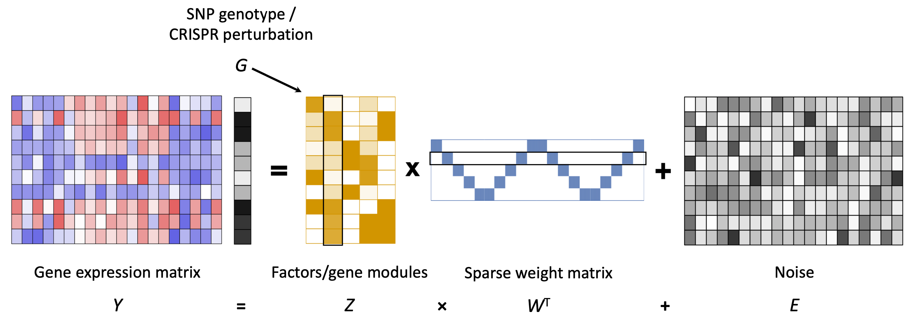

## Introduction

### Motivation

Genetic perturbation often regulates the expression of a network of genes via _trans_ effect.

#### Current computational approaches to detect _trans_ genetic effects include:
* Per-gene association analysis such as _trans_-eQTL analysis and differential expression analysis, but bears huge multiple testing burden;   
* Sparse factor analysis which takes advantage of "gene modules", but subsequent analyses are necessary to interpret the biological meaning of factors.

#### Our approach to detect the effect of genetic perturbation:   
* Identify genetically controlled factors that are correlated with the perturbation in a joint statistical framework.

We developed GSFA (Guided Sparse Factor Analysis), a factor analysis model that can infer unobserved intermediate factors given observed gene expression levels, with the advantage of inferred factors being sparse and their correlation with given sample-level conditions (_e.g._ genotype, CRISPR perturbation).

### GSFA Model

```{r echo=FALSE, out.width='100%'}

```

Given a matrix $Y \in \mathbb{R}^{N \times P}$ that holds the normalizd expression levels of $P$ genes in $N$ samples, and a guide matrix $G \in \mathbb{R}^{N \times M}$ that holds $M$ types of sample-level conditions:

$Y = ZW^T+E$, where $Z \in \mathbb{R}^{N \times K}$, $W \in \mathbb{R}^{P \times K}$, $E_{ij} \sim N(0,\psi_j)$,

$Z = G \beta + \Phi$, where $\beta \in \mathbb{R}^{M \times K}$, $\Phi_{ik} \overset{i.i.d.}{\sim} N(0,1)$.

Both $W$ and $\beta$ have spike-and-slab priors.

Gibbs sampling is used to infer the model parameters from data.

## Simulations

* [Multiple factors and guides](Simulation_multi_markers_n_factors.html);

## Applications

We applied GSFA to several published data sets of large-scale gene expression data with sample-level perturbations.

### LUHMES CROP-seq Study

#### Source and Reference
[High-throughput single-cell functional elucidation of neurodevelopmental disease-associated genes reveals convergent mechanisms altering neuronal differentiation](https://genome.cshlp.org/content/30/9/1317.full), GEO accession: GSE142078.

#### Cells
Lund human mesencephalic (LUHMES) neural progenitor cells. (Cells were sequenced in 3 batches.)

#### Perturbations
CRISPR **knock-down** of 14 autism spectrum disorder (ASD)–associated genes (3 gRNAs per gene) + 5 non-targeting gRNAs.

#### Analyses
* [Data overview](LUHMES_overview.html);
* [GSFA, 4 confounding factors corrected, NTC condition included](LUHMES_merged_new.gsfa_all_markers_detect_01.html);
* [GSFA, 3 confounding factors corrected, NTC condition included](LUHMES_merged.gsfa_all_markers_detect_01.html);
* [Gene discovery using LFSR, and comparison with DGE](LUHMES_lfsr.html).

### Primary Human T Cell CROP-seq Study

#### Source and Reference

[Genome-wide CRISPR Screens in Primary Human T Cells Reveal Key Regulators of Immune Function](https://www.ncbi.nlm.nih.gov/pmc/articles/PMC6689405/), GEO accession: GSE119450.

#### Cells

Primary human CD8+ T cells from two healthy donors, with T cell receptor (TCR) stimulation.

#### Perturbations

CRISPR **knock-out** of 20 genes (2 gRNAs per gene) + 8 non-targeting gRNAs. Target genes were either found to regulate T cell responses in the genome-wide screens, or known checkpoint genes.

#### Analyses

* Data overview;
* [GSFA, stimulated T cells pooled over 2 donors, batch effect corrected](Stimulated_TCells_merged.gsfa_all_genes_detect_01.html).

### MCF10A CROP-seq Study

#### Source and Reference
[On the design of CRISPR-based single cell molecular screens](https://www.ncbi.nlm.nih.gov/pmc/articles/PMC5882576/), GEO accession: GSE108699.

#### Cells
MCF10A cells (normal human breast epithelial cells) with exposure to a DNA damaging agent, doxorubicin;

#### Perturbations
CRISPR **knock-out** of 29 tumor-suppressor genes (TP53, ...), 1 non-targeting control;    
guide RNA readout measured on the single-cell level.

#### Analyses
* [Data overview](MCF10A_overview.html);
* [GSFA, NTC condition regressed out, singleton cells only](MCF10A_gsfa_all_markers_detect_01_singleton.html);
* [GSFA, NTC condition regressed out](MCF10A_gsfa_all_markers_detect_01_noNTC.html);
* [Permutation result for detection 10%, singleton](MCF10A_permutation_detect_01_singleton.html);
* [Gene discovery using LFSR, and comparison with DGE](MCF10A_lfsr.html).

### TCGA BRCA Somatic Mutation Study

#### References
[Perspective on Oncogenic Processes at the End of the Beginning of Cancer Genomics](https://www.ncbi.nlm.nih.gov/pmc/articles/PMC5916814/).

#### Data sources
[FireBrowse TCGA BRCA Archives](http://firebrowse.org/?cohort=BRCA&download_dialog=true).

* mRNA-seq file "illuminahiseq_rnaseqv2-RSEM_genes_normalized";    
* Mutation annotation file "Mutation_Packager_Oncotated_Calls";    
* Clinical file "Clinical_Pick_Tier1".

#### Samples
TCGA breast invasive carcinoma (BRCA) tumor samples (confined to female, Caucasian, and with somatic mutation annotation).

#### Perturbation
Somatic mutation status of selected frequently mutated driver genes (PIK3CA, TP53, TTN, GATA3, CDH1, MAP3K1, MAP2K4).

#### Analyses
* [Data overview](TCGA_BRCA_somatic_overview.html);
* [GSFA, female Caucasian only, missense + LOF mutations, RSEM normalized](TCGA_BRCA_top5_lof_missense.gsfa_rsem.html);
* [GSFA, female Caucasian only, missense + LOF mutations, TMM normalized](TCGA_BRCA_top5_lof_missense.gsfa_tmm.html);
* [GSFA, female Caucasian only, merged mutations](TCGA_BRCA_selected_7_mutations.gsfa_rsem.html);
* [GSFA, female Caucasian only, merged mutations, corrected for subtype](TCGA_BRCA_selected_7_mutations.gsfa_rsem_subtype_corrected.html);

